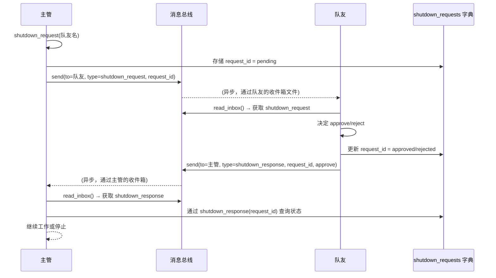
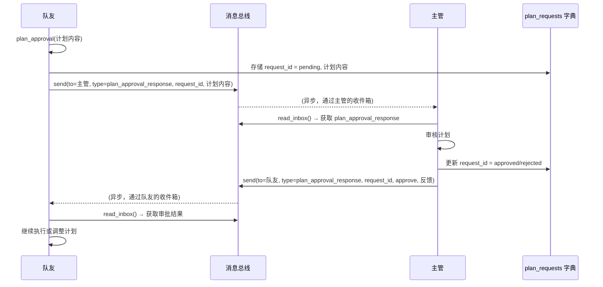

# s10: Team Protocols (团队协议)

> **注意**: 本文档已更新为 Qwen API (OpenAI 兼容)。原 Claude API 已不再使用。

`s01 > s02 > s03 > s04 > s05 > s06 | s07 > s08 > s09 > [ s10 ] s11 > s12`

> *"队友之间要有统一的沟通规矩"* -- 一个 request-response 模式驱动所有协商。

## 问题

s09 中队友能干活能通信, 但缺少结构化协调:

**关机**: 直接杀线程会留下写了一半的文件和过期的 config.json。需要握手 -- 领导请求, 队友批准 (收尾退出) 或拒绝 (继续干)。

**计划审批**: 领导说 "重构认证模块", 队友立刻开干。高风险变更应该先过审。

两者结构一样: 一方发带唯一 ID 的请求, 另一方引用同一 ID 响应。

## 解决方案

```
Shutdown Protocol            Plan Approval Protocol
==================           ======================

Lead             Teammate    Teammate           Lead
  |                 |           |                 |
  |--shutdown_req-->|           |--plan_req------>|
  | {req_id:"abc"}  |           | {req_id:"xyz"}  |
  |                 |           |                 |
  |<--shutdown_resp-|           |<--plan_resp-----|
  | {req_id:"abc",  |           | {req_id:"xyz",  |
  |  approve:true}  |           |  approve:true}  |

Shared FSM:
  [pending] --approve--> [approved]
  [pending] --reject---> [rejected]

Trackers:
  shutdown_requests = {req_id: {target, status}}
  plan_requests     = {req_id: {from, plan, status}}
```

### 协议交互时序图

#### Shutdown 协议



#### Plan Approval 协议



## 工作原理

1. 领导生成 request_id, 通过收件箱发起关机请求。

```python
shutdown_requests = {}

def handle_shutdown_request(teammate: str) -> str:
    req_id = str(uuid.uuid4())[:8]
    shutdown_requests[req_id] = {"target": teammate, "status": "pending"}
    BUS.send("lead", teammate, "Please shut down gracefully.",
             "shutdown_request", {"request_id": req_id})
    return f"Shutdown request {req_id} sent (status: pending)"
```

2. 队友收到请求后, 用 approve/reject 响应。

```python
if tool_name == "shutdown_response":
    req_id = args["request_id"]
    approve = args["approve"]
    shutdown_requests[req_id]["status"] = "approved" if approve else "rejected"
    BUS.send(sender, "lead", args.get("reason", ""),
             "shutdown_response",
             {"request_id": req_id, "approve": approve})
```

3. 计划审批遵循完全相同的模式。队友提交计划 (生成 request_id), 领导审查 (引用同一个 request_id)。

```python
plan_requests = {}

def handle_plan_review(request_id, approve, feedback=""):
    req = plan_requests[request_id]
    req["status"] = "approved" if approve else "rejected"
    BUS.send("lead", req["from"], feedback,
             "plan_approval_response",
             {"request_id": request_id, "approve": approve})
```

一个 FSM, 两种用途。同样的 `pending -> approved | rejected` 状态机可以套用到任何请求-响应协议上。

## 系统架构

整个系统由领导代理、消息总线、队友管理器、文件存储和内存追踪器构成，各组件通过明确定义的接口协作。

```mermaid
graph TB
    subgraph 用户
        U[人类用户]
    end

    subgraph 主管代理
        L[主管代理<br/>agent_loop]
        LH[工具处理器<br/>bash, read_file, ...<br/>shutdown_request, plan_approval]
    end

    subgraph 消息总线
        MB[MessageBus<br/>send() / read_inbox() / broadcast()<br/>JSONL文件位于 .team/inbox/]
    end

    subgraph 队友管理器
        TM[TeammateManager<br/>spawn() / list_all()<br/>config.json]
        TT[队友线程]
    end

    subgraph 文件系统
        FS[.team/inbox/lead.jsonl<br/>.team/inbox/队友X.jsonl]
    end

    subgraph 请求追踪器
        SR[shutdown_requests 字典<br/>request_id → 状态]
        PR[plan_requests 字典<br/>request_id → 计划 & 状态]
    end

    U -->|命令行输入| L
    L -->|调用工具| LH
    LH -->|读写文件| FS
    LH -->|发送消息| MB
    LH -->|管理队友| TM
    LH -->|查询/更新追踪器| SR
    LH -->|查询/更新追踪器| PR

    MB -->|写入| FS
    MB -->|读取| FS

    TM -->|启动线程| TT
    TT -->|每个队友运行| TA[队友代理<br/>_teammate_loop]
    TA -->|使用工具| TTools[队友工具集<br/>bash, read_file, ...<br/>shutdown_response, plan_approval]
    TTools -->|发送消息| MB
    TTools -->|读取消息| MB
    TTools -->|更新追踪器| SR
    TTools -->|更新追踪器| PR
```

## 相对 s09 的变更

| 组件           | 之前 (s09)       | 之后 (s10)                           |
|----------------|------------------|--------------------------------------|
| Tools          | 9                | 12 (+shutdown_req/resp +plan)        |
| 关机           | 仅自然退出       | 请求-响应握手                        |
| 计划门控       | 无               | 提交/审查与审批                      |
| 关联           | 无               | 每个请求一个 request_id              |
| FSM            | 无               | pending -> approved/rejected         |

## 试一试

```sh
cd learn-claude-code
python agents/s10_team_protocols.py
```

试试这些 prompt (英文 prompt 对 LLM 效果更好, 也可以用中文):

1. `Spawn alice as a coder. Then request her shutdown.`
2. `List teammates to see alice's status after shutdown approval`
3. `Spawn bob with a risky refactoring task. Review and reject his plan.`
4. `Spawn charlie, have him submit a plan, then approve it.`
5. 输入 `/team` 监控状态